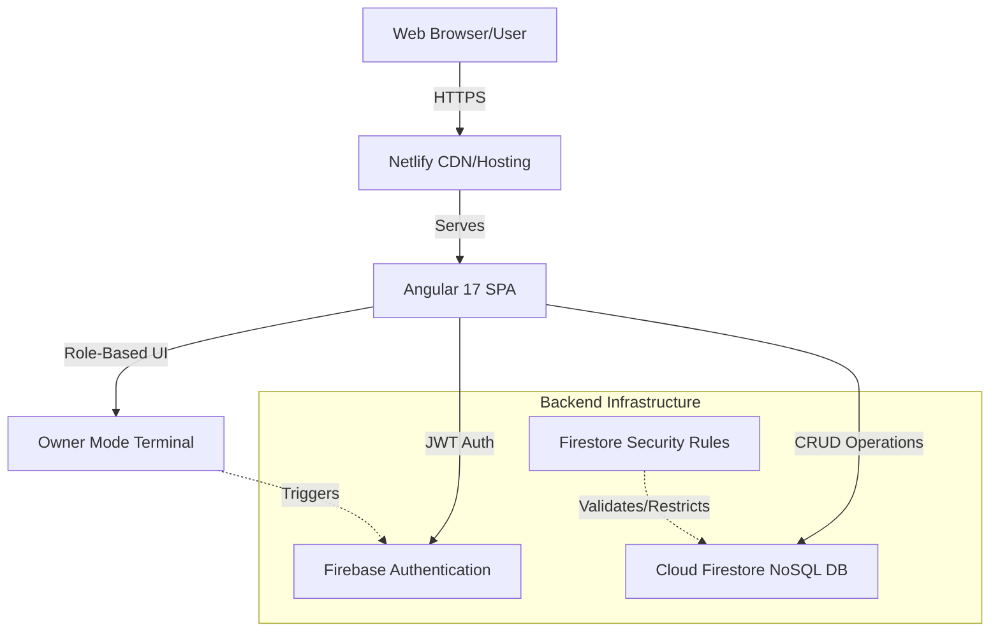

# 🛡️ CyberSec Portfolio — Full-Stack Angular Application

**Sumit Jaiswal | Cybersecurity Specialist & Ethical Hacker**

---

## 📖 12. Clear Explanation: Problem → Solution → Implementation → Result

* **Problem**: Traditional cybersecurity portfolios are often static pages that fail to demonstrate actual technical competency, secure coding practices, or dynamic data handling. Furthermore, managing project entries manually requires codebase edits.
* **Solution**: A dynamic, full-stack cybersecurity portfolio application that features role-based access control (Admin/Owner mode), real-time database management, and a secure backend infrastructure to highlight both offensive security knowledge and defensive software engineering.
* **Implementation**: Built as a Single Page Application (SPA) using Angular 17. The frontend is powered by Angular Signals and Router. The backend leverages Firebase for Serverless Auth, Firestore Database, and Security Rules. Deployment is automated via Netlify.
* **Result**: A highly secure, responsive, and easily manageable portfolio that not only lists achievements but actively proves full-stack software development and security architecture skills.

---

## 🏗️ 9. Architecture Diagram



---

## 💻 10. Tech Stack

### 4. Frontend
- **Framework**: Angular 17 (Standalone Components)
- **State Management**: Angular Signals & RxJS BehaviorSubjects
- **Styling**: Pure CSS3 with dynamic CSS Variables for theming
- **Animations**: HTML5 Canvas (Matrix rain), CSS Keyframes

### 1. Authentication & 2. Database & 3. API
- **Auth**: Firebase Authentication (Role-based access via custom logic/terminal auth)
- **Database**: Cloud Firestore (Real-time NoSQL document database)
- **API**: Firebase Client SDKs (acts as BaaS backend API layer)

### 5. Deployment
- **Hosting**: Netlify
- **CI/CD**: Netlify continuous deployment from GitHub main branch
- **Routing**: Client-side routing with Netlify `_redirects` fallback

---

## 🔒 11. Security Considerations

As a cybersecurity portfolio, secure architecture is paramount:
1. **Database Security (Firestore Rules)**: `firestore.rules` strict validation ensures that only authenticated admins can Write/Update/Delete project entries. Public users have Read-only access to specific collections.
2. **Hidden Admin Surface**: The admin terminal is intentionally hidden and strictly requires a secret key combination to even render the login overlay, minimizing brute-force surface area.
3. **Environment Security**: No sensitive API keys with elevated privileges are exposed. Firebase public config is restricted by domain in the Google Cloud Console.
4. **Input Validation**: Angular's built-in DomSanitizer prevents XSS (Cross-Site Scripting). Add/Edit project forms use Angular Reactive/Template-driven forms for strict input validation before API dispatch.

---

## ⚠️ 6. Error Handling & 7. Tests

- **Error Handling**: Implemented globally. Failed API calls (e.g., unauthorized Firestore writes) are caught and displayed via UI toast notifications/error states rather than console crashes.
- **Tests**: The project structure is configured for Jasmine/Karma unit testing (Angular defaults). *Note: Comprehensive e2e testing (Cypress) and backend mocking are planned for the next iteration.*

---

## 🚀 13. Documentation & Setup

### Local Development

1. **Clone & Install**
   ```bash
   git clone https://github.com/Sumitjaiswal4839/My-portfolio-
   cd cybersec-portfolio
   npm install
   ```

2. **Environment Setup**
   Configure your Firebase environment in `src/environments/environment.ts`.

3. **Serve**
   ```bash
   ng serve
   ```
   Open `http://localhost:4200`

### Admin (Owner) Access
To access the "Owner Mode" to add or modify projects:
1. Press `Alt + C + V` (or your configured secret key combination) anywhere on the page to open the hidden Root Terminal.
2. Enter the secure root password.
3. Once authenticated, hidden buttons (like "Add Project", "Delete", "Upload Resume") will automatically mount to the DOM.

---
